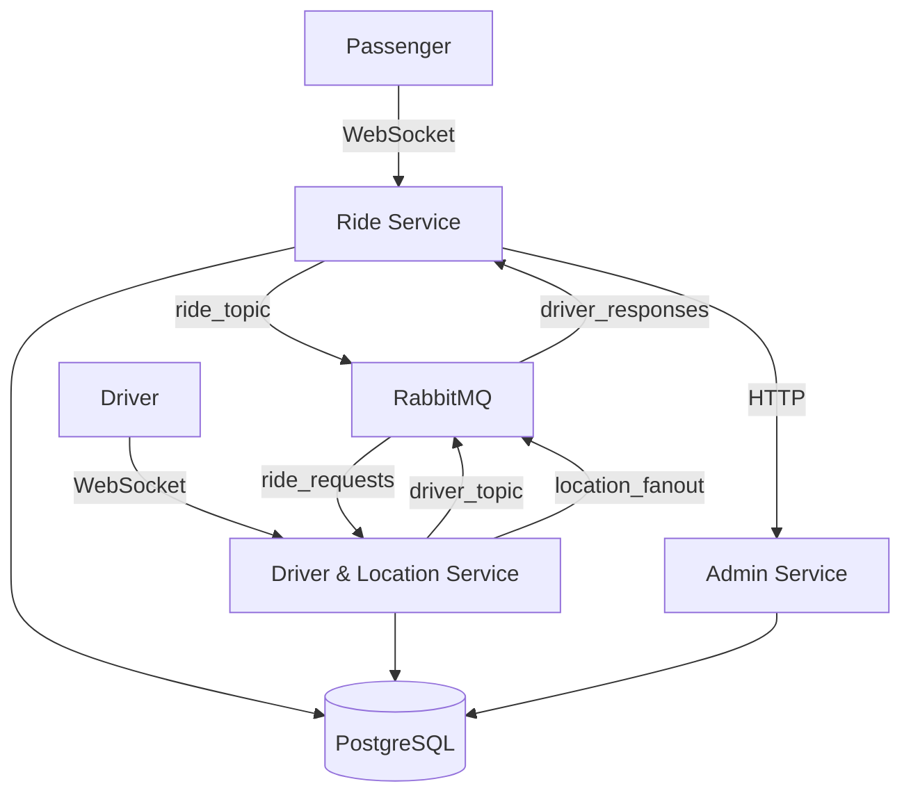

# 🚗 Ride-Hail Microservices Platform


A real-time distributed ride-hailing platform built with Go microservices, featuring real-time driver matching, live location tracking, and comprehensive monitoring.

## 📋 Table of Contents

- [Overview](#-overview)
- [Architecture](#-architecture)
- [Quick Start](#-quick-start)
- [API Documentation](#-api-documentation)
- [WebSocket Events](#-websocket-events)
- [Configuration](#-configuration)
- [Development](#-development)

## 🎯 Overview

Ride-Hail is a sophisticated microservices platform that simulates modern ride-hailing services like Uber. Built with **Service-Oriented Architecture (SOA)** principles, it demonstrates advanced distributed systems patterns including:

- 🔄 **Real-time communication** via WebSockets
- 📡 **Message queue patterns** with RabbitMQ
- 🗺️ **Geospatial data processing**
- 📊 **Distributed state management**
- ⚡ **High-concurrency programming**

### Tech Stack

| Component | Technology |
|-----------|------------|
| **Language** | Go 1.24.5 |
| **Database** | PostgreSQL 16 |
| **Message Broker** | RabbitMQ 3.9 |
| **WebSocket** | Gorilla WebSocket |
| **Authentication** | JWT |
| **Architecture** | Microservices SOA |

## 🏗️ Architecture

### System Design



### Service Responsibilities

| Service | Port | Description |
|---------|------|-------------|
| **Ride Service** | 3000 | Orchestrates ride lifecycle, passenger interactions |
| **Driver & Location Service** | 3001 | Manages drivers, matching, real-time location |
| **Admin Service** | 3004 | System monitoring and analytics |
| **WebSocket Server** | 3000 | Real-time bidirectional communication |

## 🚀 Quick Start

### Prerequisites

- Go 1.24.5+
- PostgreSQL 16+
- RabbitMQ 3.9+
- Docker & Docker Compose (optional)

### Installation

1. **Clone the repository**
```bash
git clone https://github.com/maru-tm/ride-hail.git
cd ride-hail
```

2. **Set up environment**
```bash
cp configs/config.yaml.example configs/config.yaml
# Edit configuration as needed
```

3. **Start dependencies with Docker**
```bash
docker-compose up -d
```

4. **Run database migrations**
```bash
go run main.go
# Migrations run automatically on startup
```

5. **Build and run the application**
```bash
go build -o ride-hail-system .
./ride-hail-system
```

### Verify Installation

Check if services are running:
```bash
curl http://localhost:8080/admin/overview
```

## 📚 API Documentation

### Authentication Endpoints

#### 🔐 Register User
```http
POST /register
Content-Type: application/json

{
  "name": "Alex Petrov",
  "email": "alex@example.com", 
  "password": "securityPassword123",
  "role": "PASSENGER"
}
```

#### 🔐 Register Driver
```http
POST /register
Content-Type: application/json

{
  "name": "Ivan Ivanov",
  "email": "ivan@example.com",
  "password": "securityPassword123", 
  "role": "DRIVER",
  "license_number": "KZ123ABC",
  "vehicle_type": "ECONOMY",
  "vehicle_attrs": {
    "brand": "Toyota",
    "model": "Camry", 
    "year": 2020,
    "color": "White"
  }
}
```

#### 🔑 Login
```http
POST /login
Content-Type: application/json

{
  "email": "alex@example.com",
  "password": "securityPassword123"
}
```

Response:
```json
{
  "access_token": "eyJhbGciOiJIUzI1NiIs...",
  "refresh_token": "eyJhbGciOiJIUzI1NiIs..."
}
```

### Ride Management

#### 🚖 Create Ride Request
```http
POST /rides
Authorization: Bearer {access_token}
Content-Type: application/json

{
  "passenger_id": "9a3c3277-f95d-411a-a46a-d52a78df511d",
  "pickup_latitude": 43.238949,
  "pickup_longitude": 76.889709,
  "pickup_address": "Abay Ave 25, Almaty",
  "destination_latitude": 43.256542, 
  "destination_longitude": 76.928482,
  "destination_address": "Tole Bi St 120, Almaty",
  "ride_type": "ECONOMY"
}
```

Response:
```json
{
  "ride_id": "4bf152a5-0ce1-4e92-ae42-982fcab05aab",
  "ride_number": "RIDE_20251029_011421", 
  "status": "REQUESTED",
  "estimated_fare": 1450.0,
  "estimated_duration_minutes": 15,
  "estimated_distance_km": 5.2
}
```

#### ❌ Cancel Ride
```http
POST /rides/{ride_id}/cancel
Authorization: Bearer {access_token} 
Content-Type: application/json

{
  "reason": "Changed my mind"
}
```

### Driver Operations

#### 🟢 Go Online
```http
POST /drivers/{driver_id}/online
Authorization: Bearer {access_token}
Content-Type: application/json

{
  "latitude": 43.238949,
  "longitude": 76.889709
}
```

#### 🔴 Go Offline
```http
POST /drivers/{driver_id}/offline
Authorization: Bearer {access_token}
```

#### 📍 Update Location
```http
POST /drivers/{driver_id}/location
Authorization: Bearer {access_token}
Content-Type: application/json

{
  "latitude": 43.238949,
  "longitude": 76.889709,
  "accuracy_meters": 5.0,
  "speed_kmh": 45.0,
  "heading_degrees": 180.0
}
```

#### 🚦 Start Ride
```http
POST /drivers/{driver_id}/start
Authorization: Bearer {access_token}
Content-Type: application/json

{
  "ride_id": "4bf152a5-0ce1-4e92-ae42-982fcab05aab",
  "driver_location": {
    "latitude": 43.238949,
    "longitude": 76.889709
  }
}
```

#### ✅ Complete Ride
```http
POST /drivers/{driver_id}/complete  
Authorization: Bearer {access_token}
Content-Type: application/json

{
  "ride_id": "4bf152a5-0ce1-4e92-ae42-982fcab05aab",
  "final_location": {
    "latitude": 43.256542,
    "longitude": 76.928482
  },
  "actual_distance_km": 5.5,
  "actual_duration_minutes": 16
}
```

### Admin Dashboard

#### 📊 System Overview
```http
GET /admin/overview
Authorization: Bearer {access_token}
```

#### 📈 Active Rides
```http
GET /admin/rides/active?page=1&page_size=20
Authorization: Bearer {access_token}
```

#### 👥 Online Drivers
```http
GET /admin/drivers/online
Authorization: Bearer {access_token}
```

## 🔌 WebSocket Events

### Connection Setup

Connect to WebSocket endpoints with authentication:

**Passengers:**
```bash
wscat -c ws://localhost:3000/ws/passengers/
```

**Drivers:**
```bash  
wscat -c ws://localhost:3000/ws/drivers/
```

### Authentication Message
```json
{
  "type": "auth",
  "token": "eyJhbGciOiJIUzI1NiIsInR5cCI6IkpXVCJ9..."
}
```

### Ride Flow Events

#### 1. Ride Offer to Driver
```json
{
  "type": "ride_offer",
  "ride_id": "4bf152a5-0ce1-4e92-ae42-982fcab05aab",
  "ride_number": "RIDE_20251029_011421",
  "pickup_location": {
    "latitude": 43.238949,
    "longitude": 76.889709,
    "address": "Abay Ave 25, Almaty"
  },
  "destination_location": {
    "latitude": 43.256542,
    "longitude": 76.928482, 
    "address": "Tole Bi St 120, Almaty"
  },
  "estimated_fare": 1500.0,
  "timeout_seconds": 30
}
```

#### 2. Driver Accepts Ride
```json
{
  "type": "ride_response", 
  "ride_id": "4bf152a5-0ce1-4e92-ae42-982fcab05aab",
  "accepted": true,
  "current_location": {
    "latitude": 43.235,
    "longitude": 76.885
  }
}
```

#### 3. Passenger Notified of Match
```json
{
  "type": "ride_status_update",
  "ride_id": "4bf152a5-0ce1-4e92-ae42-982fcab05aab", 
  "status": "MATCHED",
  "driver_info": {
    "driver_id": "9f11a85d-ca05-4bfb-8467-4d8bf2dc0a96",
    "name": "Ivan Ivanov",
    "rating": 4.8,
    "vehicle": {
      "make": "Toyota",
      "model": "Camry",
      "color": "White",
      "plate": "KZ123ABC"
    }
  }
}
```

#### 4. Passenger Details Sent to Driver
```json
{
  "type": "ride_details",
  "ride_id": "4bf152a5-0ce1-4e92-ae42-982fcab05aab",
  "passenger_name": "Alex Petrov", 
  "passenger_phone": "+7-XXX-XXX-XX-XX",
  "pickup_location": {
    "latitude": 43.238949,
    "longitude": 76.889709,
    "address": "Abay Ave 25, Almaty",
    "notes": "Near the main entrance"
  }
}
```

#### 5. Real-time Location Updates
```json
{
  "type": "location_update",
  "driver_id": "9f11a85d-ca05-4bfb-8467-4d8bf2dc0a96",
  "ride_id": "4bf152a5-0ce1-4e92-ae42-982fcab05aab", 
  "location": {
    "lat": 43.236,
    "lng": 76.886
  },
  "speed_kmh": 45.0,
  "heading_degrees": 180.0,
  "timestamp": "2024-12-16T10:35:30Z"
}
```

## ⚙️ Configuration

### Environment Variables

| Variable | Default | Description |
|----------|---------|-------------|
| `DB_HOST` | `localhost` | PostgreSQL host |
| `DB_PORT` | `5432` | PostgreSQL port |
| `DB_USER` | `ridehail_user` | Database user |
| `DB_PASSWORD` | `ridehail_pass` | Database password |
| `DB_NAME` | `ridehail_db` | Database name |
| `RABBITMQ_HOST` | `localhost` | RabbitMQ host |
| `RABBITMQ_PORT` | `5672` | RabbitMQ port |
| `WS_PORT` | `8080` | WebSocket port |

### Configuration File

```yaml
database:
  host: ${DB_HOST:-localhost}
  port: ${DB_PORT:-5432}
  user: ${DB_USER:-ridehail_user}
  password: ${DB_PASSWORD:-ridehail_pass}
  database: ${DB_NAME:-ridehail_db}

rabbitmq:
  host: ${RABBITMQ_HOST:-localhost}
  port: ${RABBITMQ_PORT:-5672}
  user: ${RABBITMQ_USER:-guest}
  password: ${RABBITMQ_PASSWORD:-guest}

websocket:
  port: ${WS_PORT:-8080}

services:
  ride_service: ${RIDE_SERVICE_PORT:-3000}
  driver_location_service: ${DRIVER_LOCATION_SERVICE_PORT:-3001}
  admin_service: ${ADMIN_SERVICE_PORT:-3004}
```

## 🛠️ Development

### Project Structure

```
ride-hail/
├── cmd/                          # Service entry points
│   ├── ride-service/
│   ├── driver-location-service/
│   ├── user-service/
│   └── admin-service/
├── internal/
│   ├── ride/                     # Ride service
│   ├── driver/                   # Driver service  
│   ├── user/                     # User service
│   ├── admin/                    # Admin service
│   └── common/                   # Shared utilities
├── migrations/                   # Database migrations
├── configs/                      # Configuration files
└── pkg/                          # Shared packages
```

## 📈 Monitoring & Logging

### Structured Logging

All services output JSON logs with consistent structure:

```json
{
  "timestamp": "2024-12-16T10:30:00Z",
  "level": "INFO", 
  "service": "ride-service",
  "action": "ride_requested",
  "message": "Ride created successfully",
  "hostname": "server-01",
  "request_id": "req_123456",
  "ride_id": "4bf152a5-0ce1-4e92-ae42-982fcab05aab"
}
```

### RabbitMQ Monitoring

Access RabbitMQ management interface:
```
http://localhost:15672
Username: guest
Password: guest
```


## 📄 License

This project is developed for educational purposes as part of distributed systems learning objectives.

---

<div align="center">

**Built with ❤️ using Go, PostgreSQL, and RabbitMQ**

*Experience the future of ride-hailing with real-time microservices architecture!*

</div>
